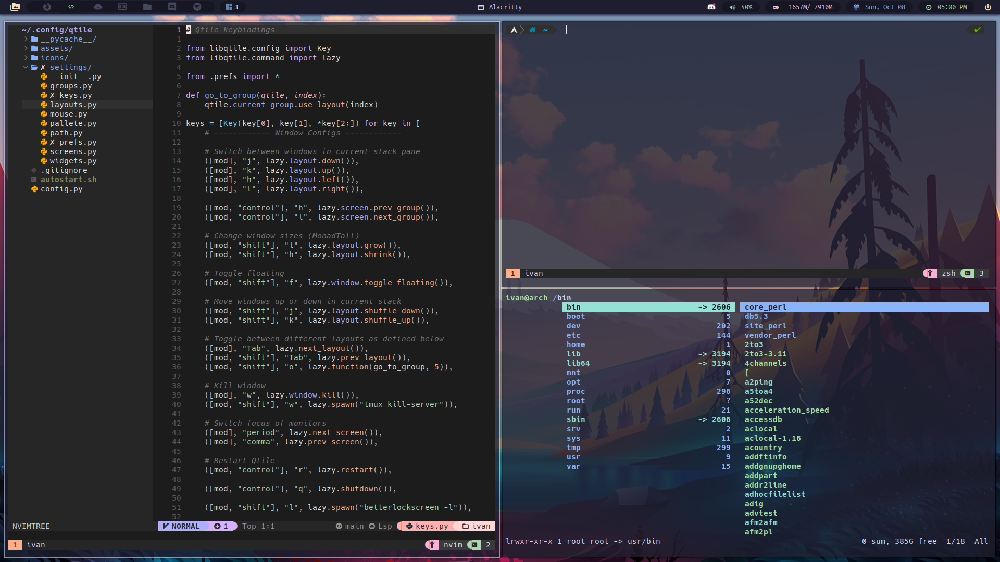

# My Dotfiles

These are my dotfiles for configuring my Arch Linux environment. These dotfiles are designed to work with a fresh Arch Linux installation. Included is an autoinstaller script that will help set up my preferred software and configurations quickly.

## Features

- **Window Manager:** [Qtile](http://www.qtile.org/)
- **Launcher:** [Rofi](https://github.com/davatorium/rofi)
- **Terminal:** [Alacritty](https://github.com/alacritty/alacritty)
- **Shell:** [Zsh](https://www.zsh.org/)
- **Compositor:** [Picom](https://github.com/yshui/picom)
- **Code Editor:** [Neovim (nvim)](https://neovim.io/)
- **Bootloader:** [Grub](https://www.gnu.org/software/grub/grub.html)

## Prerequisites

Before running the installer, make sure you have:

- [Arch Linux](https://www.archlinux.org/) installed on your system.
- An internet connection to download and install packages.

## Installation

To set up my environment, you can use the provided autoinstaller script. It will install the required packages, symlink the dotfiles, and configure your system according to my preferences.

```bash
git clone https://github.com/ivanpolanis/dotfiles
cd dotfiles
cp progs.csv ~/
chmod +x autoinstall.sh
sudo ./autoinstall.sh
```

Make sure to review the `autoinstall.sh` script before running it to ensure it aligns with your preferences.

## Usage

These dotfiles are meant to provide you with a ready-to-use Arch Linux environment with my preferred configurations. You can customize them further to suit your needs.

## Customization

Feel free to modify these dotfiles to suit your preferences. You can add or remove packages, change keybindings, and tweak configurations as needed.

## Screenshot


